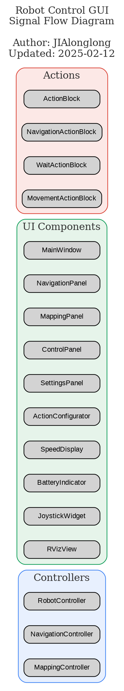

# Robot Control GUI

这是一个基于 ROS 和 Qt 的 TurtleBot3 机器人控制界面，提供了直观的可视化控制和状态监控功能。

## ✨ 功能特性

### 🎮 机器人控制
- 虚拟摇杆控制（线速度和角速度）
- 键盘控制（方向键和空格键）
- 紧急停止功能

### 🗺️ 自动定位
- 基于AMCL的自适应定位
- 智能避障系统（20cm安全距离）
- 定位质量评估
- 可视化标记显示

### 🎯 路径规划
- 多种规划算法（Dijkstra、A*、RRT、RRT*）
- 可配置的启发式函数
- 规划参数实时调整
- 规划过程可视化

### 📊 状态监控
- 机器人状态显示（电池、WiFi信号等）
- 速度仪表盘显示
- 传感器数据可视化
- 运行状态监控

## 🔧 系统要求

- Ubuntu 20.04
- ROS Noetic
- Qt 5.12+
- OpenGL 2.1+
- TurtleBot3 相关包

## 📦 安装

1. 克隆仓库：
```bash
cd ~/catkin_ws/src
git clone https://github.com/JIAlonglong/robot_control_gui.git
```

2. 安装依赖：
```bash
sudo apt-get update
sudo apt-get install ros-noetic-rviz ros-noetic-turtlebot3 ros-noetic-turtlebot3-msgs
rosdep install --from-paths src --ignore-src -r -y
```

3. 编译：
```bash
cd ~/catkin_ws
catkin_make
source devel/setup.bash
```

## 🚀 使用方法

1. 启动 TurtleBot3 仿真（或实体机器人）：
```bash
export TURTLEBOT3_MODEL=burger
roslaunch turtlebot3_gazebo turtlebot3_world.launch
```

2. 启动控制界面：
```bash
roslaunch robot_control_gui robot_control_gui.launch
```

### 控制说明
- 虚拟摇杆：
  - 左侧：控制线速度（上下移动）
  - 右侧：控制角速度（左右移动）
- 键盘控制：
  - ↑：前进
  - ↓：后退
  - ←：左转
  - →：右转
  - 空格：紧急停止

## 📚 文档

### 设计文档
- [系统设计](docs/design/README.md)
- [系统架构](docs/design/architecture.md)
- [实现细节](docs/implementation_details.md)

### 开发文档
- [开发指南](docs/development/README.md)
- [代码风格](docs/development/code_style.md)
- [路径规划](docs/development/path_planning.md)

### API文档
- [API参考](docs/api/README.md)

### 功能文档
- [自动定位](docs/auto_localization.md)
- [动作配置](docs/action_configuration.md)

### 其他文档
- [故障排除](docs/troubleshooting.md)

## 🤝 贡献

欢迎提交问题和改进建议！请查看[开发指南](docs/development/README.md)了解如何参与项目开发。

## 📄 许可证

本项目采用 MIT 许可证 - 详见 [LICENSE](LICENSE) 文件

## 👨‍💻 维护者

[@JIAlonglong](https://github.com/JIAlonglong)

## 📝 更新日志

详见 [CHANGELOG.md](CHANGELOG.md)

## 快捷键指南

### 面板切换
- `Ctrl + 1`: 切换到控制面板
- `Ctrl + 2`: 切换到导航面板
- `Ctrl + 3`: 切换到建图面板
- `Ctrl + 4`: 切换到设置面板
- `Ctrl + 5`: 切换到动作配置器

### 文件操作
- `Ctrl + S`: 保存地图（在建图面板中）
- `Ctrl + O`: 加载地图（在建图面板中）
- `Alt + F4`: 退出程序

### 编辑操作
- `Ctrl + Z`: 撤销（在动作配置器中）
- `Ctrl + Y`: 重做（在动作配置器中）

### 视图控制
- `F5`: 刷新RViz显示
- `F1`: 显示帮助信息

### 机器人控制
- `空格键`: 紧急停止
- 方向键控制（在控制面板激活时）:
  - `W`: 前进
  - `S`: 后退
  - `A`: 左转
  - `D`: 右转

### 菜单快捷键
- `Alt + F`: 打开文件菜单
- `Alt + E`: 打开编辑菜单
- `Alt + V`: 打开视图菜单
- `Alt + H`: 打开帮助菜单

## 注意事项
1. 首次运行前请确保ROS环境正确配置
2. 确保机器人硬件连接正常
3. 建图前请检查激光雷达工作状态
4. 导航时注意避免碰撞

## 故障排除
1. 如果RViz显示异常，尝试使用F5刷新
2. 连接失败时检查网络设置
3. 建图异常时检查激光雷达数据
4. 导航失败时检查定位状态

## 联系方式
- 邮箱：jialonglongliu@gmail.com
- GitHub：https://github.com/JIAlonglong 

## 信号流图


