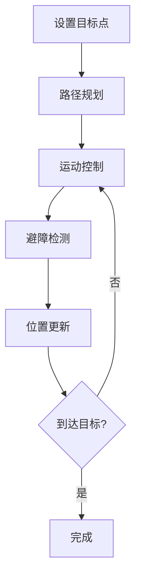

# 系统设计文档

## 1. 系统架构

### 1.1 整体架构

系统采用分层架构设计，主要包含以下层次：

1. 用户界面层（GUI）
   - 机器人状态显示
   - 控制面板
   - 地图显示
   - 参数配置界面

2. 业务逻辑层
   - 机器人控制器（RobotController）
   - 导航管理器（NavigationManager）
   - 定位管理器（LocalizationManager）
   - 地图管理器（MapManager）

3. ROS通信层
   - 话题发布/订阅
   - 服务调用
   - Action客户端

4. 硬件抽象层
   - 激光雷达驱动
   - 电机控制
   - 传感器接口

### 1.2 核心模块

#### 1.2.1 RobotController

负责机器人的核心控制逻辑：
- 运动控制
- 状态监控
- 安全管理
- 任务调度

#### 1.2.2 NavigationManager

提供导航相关功能：
- 路径规划
- 避障控制
- 目标管理
- 导航状态监控

#### 1.2.3 LocalizationManager

管理机器人定位相关功能：
- AMCL参数配置
- 自动定位控制
- 位姿估计
- 定位质量评估

## 2. 网络架构

### 2.1 主从机模式

```
Master Node (控制端)
    │
    ├── Robot Node 1
    │   ├── /cmd_vel
    │   ├── /scan
    │   └── /odom
    │
    └── Robot Node 2
        ├── /cmd_vel
        ├── /scan
        └── /odom
```

### 2.2 通信接口

1. 控制指令
```yaml
# 速度控制
/cmd_vel:
  type: geometry_msgs/Twist
  frequency: 10Hz
  qos: reliable

# 导航目标
/move_base_simple/goal:
  type: geometry_msgs/PoseStamped
  qos: reliable
```

2. 状态反馈
```yaml
# 机器人状态
/robot_status:
  type: custom_msgs/RobotStatus
  frequency: 1Hz
  qos: best_effort

# 定位信息
/amcl_pose:
  type: geometry_msgs/PoseWithCovarianceStamped
  frequency: 5Hz
  qos: reliable
```

## 3. 数据流设计

### 3.1 控制流程


### 3.2 导航流程



## 4. 安全机制

### 4.1 碰撞避免

```cpp
class CollisionAvoidance {
    double safety_distance = 0.3;  // 米
    double slow_down_distance = 0.5;
    double emergency_stop_distance = 0.2;
    
    void checkSafety(const LaserScan& scan);
    void adjustVelocity(double& linear_vel, double& angular_vel);
};
```

### 4.2 异常处理

```cpp
class SafetyManager {
    enum class ErrorLevel {
        INFO,
        WARNING,
        ERROR,
        CRITICAL
    };
    
    void handleError(ErrorLevel level, const std::string& message);
    void emergencyStop();
    void recoverFromError();
};
```

## 5. 性能优化

### 5.1 实时性优化

```yaml
# 线程优先级
thread_priority:
  control_thread: HIGH
  visualization_thread: NORMAL
  logging_thread: LOW

# 消息队列
message_queue:
  cmd_vel_queue_size: 1
  scan_queue_size: 10
  map_queue_size: 5
```

### 5.2 资源管理

```yaml
# 内存管理
memory_limits:
  map_cache: 512MB
  scan_buffer: 100MB
  visualization_buffer: 200MB

# CPU使用
cpu_management:
  max_threads: 4
  core_affinity: [0,1]
```

## 6. 扩展性设计

### 6.1 插件系统

```cpp
class PluginInterface {
public:
    virtual void initialize() = 0;
    virtual void start() = 0;
    virtual void stop() = 0;
    virtual ~PluginInterface() = default;
};
```

### 6.2 配置系统

```yaml
# 配置文件结构
config:
  robot:
    - model_config.yaml
    - hardware_config.yaml
  navigation:
    - costmap_config.yaml
    - planner_config.yaml
  visualization:
    - rviz_config.yaml
```

## 7. 测试策略

### 7.1 单元测试

```cpp
TEST(RobotControllerTest, VelocityCommandTest) {
    auto controller = RobotController();
    auto cmd = controller.calculateVelocity(1.0, 0.0);
    EXPECT_NEAR(cmd.linear.x, 1.0, 0.01);
    EXPECT_NEAR(cmd.angular.z, 0.0, 0.01);
}
```

### 7.2 集成测试

```bash
# 测试脚本
rostest robot_control_gui integration_test.test
```

## 8. 部署方案

### 8.1 Docker部署

```dockerfile
FROM ros:noetic

# 安装依赖
RUN apt-get update && apt-get install -y \
    ros-noetic-navigation \
    ros-noetic-rviz \
    qt5-default

# 复制源代码
COPY . /catkin_ws/src/robot_control_gui

# 编译
RUN /bin/bash -c "source /opt/ros/noetic/setup.bash && \
    cd /catkin_ws && \
    catkin_make"
```

### 8.2 启动配置

```yaml
# launch文件配置
launch:
  - robot_bringup.launch
  - navigation.launch
  - gui.launch
``` 